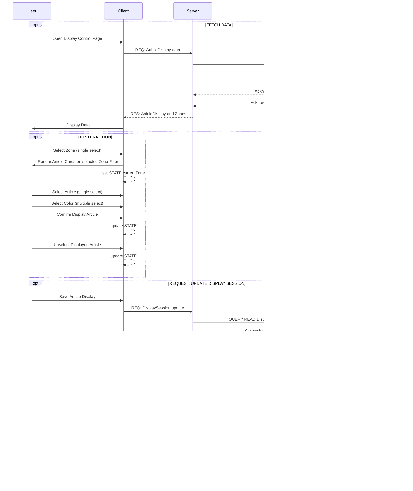

```mermaid
sequenceDiagram
    participant User
    participant Client
    participant Server
    participant Database

opt FETCH DATA
    User->>Client: Open Display Control Page
    Client->>Server: REQ: ArticleDisplay data
    Server->>Database: READ QUERY
    Database->>Database: AGGREGATION PIPELINE
    Database-->>Server: Acknowledged: Queried Data
    Database-->>Server: Acknowledged: Zones documents
    Server-->>Client: RES: ArticleDisplay and Zones
    Client->>User: Display Data
end

opt UX INTERACTION
    User ->> Client: Select Zone (single select)
    Client ->> User: Render Article Cards on selected Zone Filter
    Client -->> Client: set STATE:currentZone

    User ->> Client: Select Article (single select)
    User ->> Client: Select Color (multiple select)
    User ->> Client: Confirm Display Article
    Client -->> Client: update STATE

    User ->> Client: Unselect Displayed Article
    Client -->> Client: update STATE
end

opt REQUEST: UPDATE DISPLAY SESSION
    User ->> Client: Save Article Display
    Client ->> Server: REQ: DisplaySession update

    Server->>Database: QUERY READ DisplaySessions WHERE endDate: NULL
    Database-->>Server: Acknowledged: "ActiveDisplaySessions"

    Server->>Server: FILTER OUT Article-Color-Zone WITH displayed=TRUE AND DisplaySession endDate: NULL

    Server->>Server: FILTER AND GROUP Article-Color-Zone WITH displayed=TRUE AND not included in "ActiveDisplaySessions"
    Server->>Database: INSERT NEW DOCUMENT to DisplaySessions WITH endDate: NULL
    Database-->>Server: Acknowledged

    Server->>Server: FILTER AND GROUP Article-Color-Zone WITH displayed=FALSE AND DisplaySession endDate: NULL
    Server->>Database: UPDATE DOCUMENT to DisplaySessions WHERE Article-Color-Zone WITH endDate: NOW
    Database-->>Server: Acknowledged

    Server-->>Client: RES: Operation Complete
    Client->>User: Updates Saved Notification
end
```
